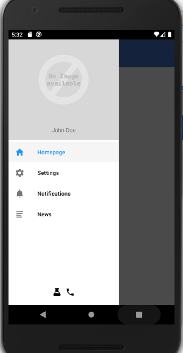

# react-hamburger-menu

To install:
***
make sure you have android sdk environement variable set
***
or
***
create a file named local.properties in /android, filled with sdk.dir = /home/YOURUSERNAME/Android/Sdk

***
Launch the app on device or emulator :
***
react-native start
***
react-native run-android
***

